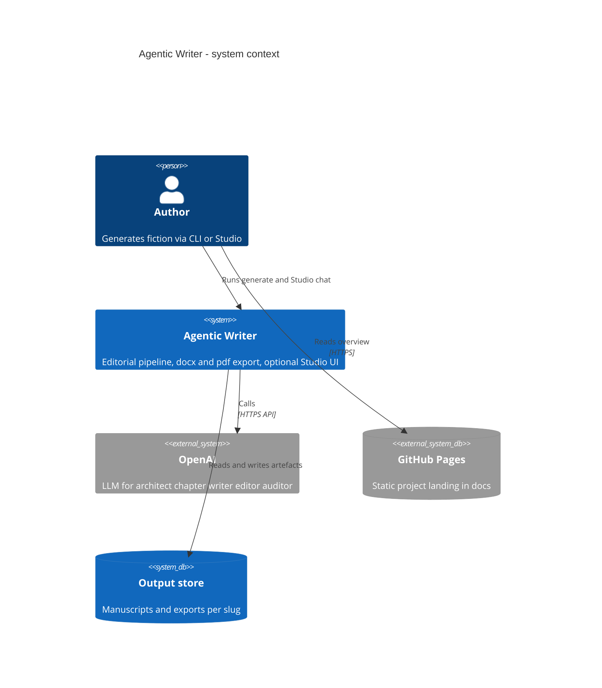
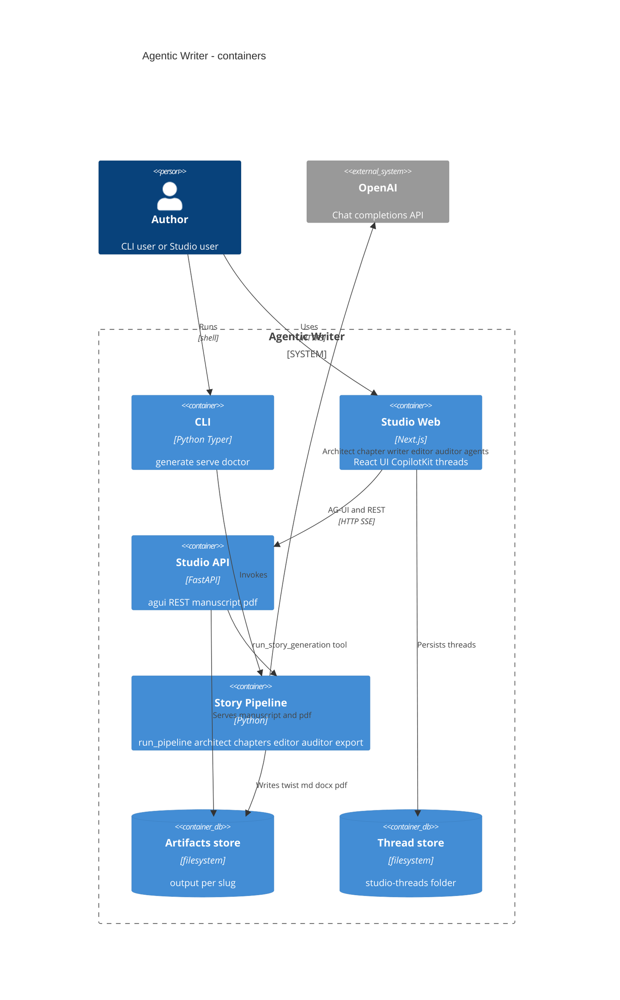
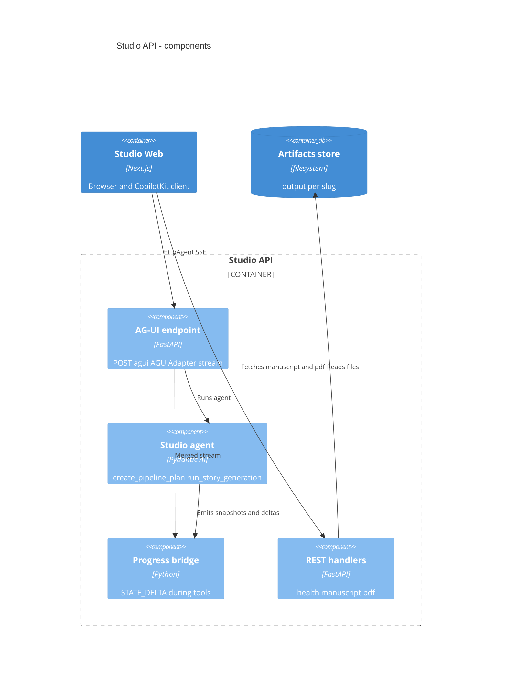
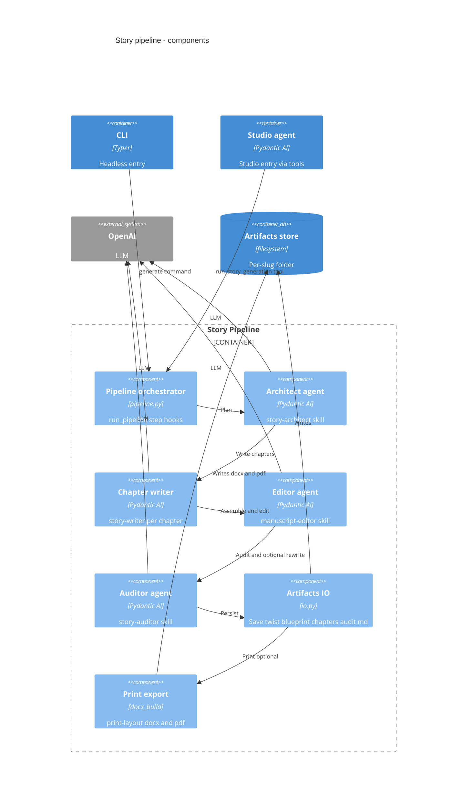
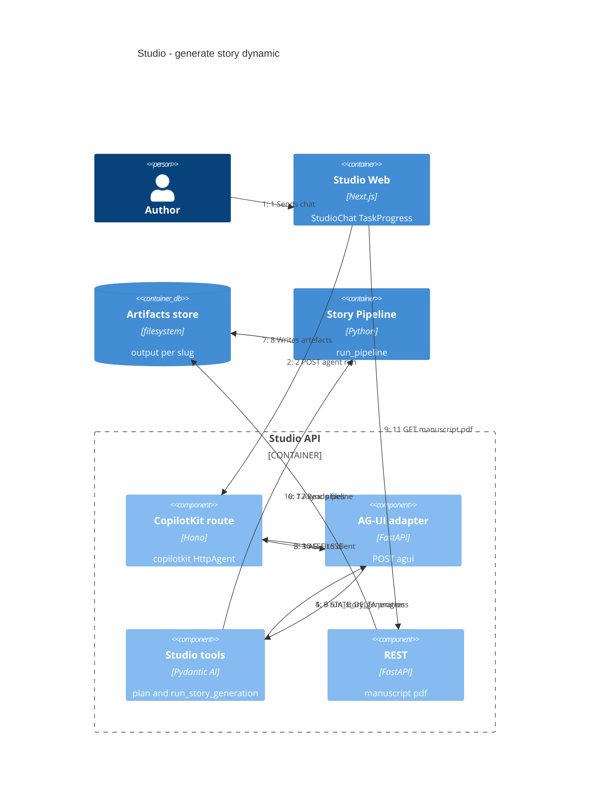
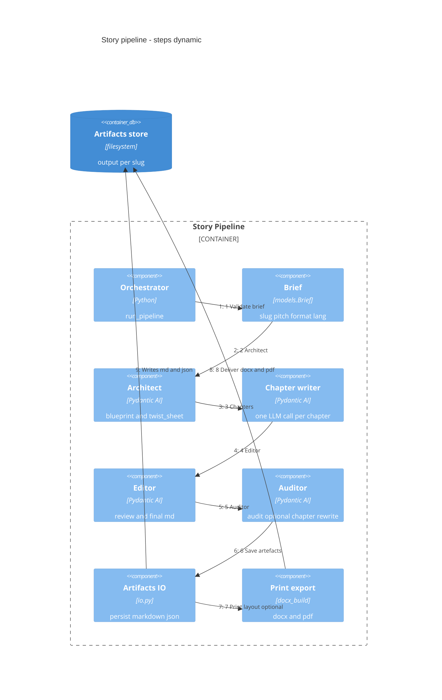
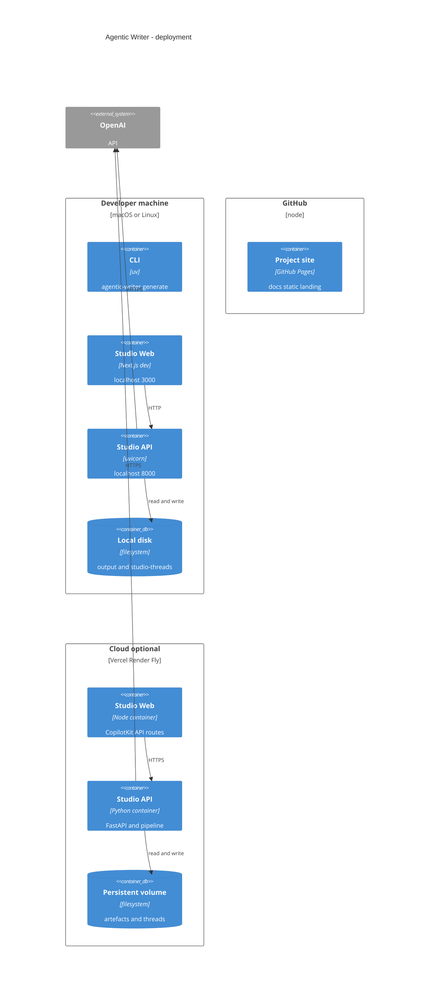

# Agentic Writer

Automated **editorial story pipeline**: plan twists and chapters, write **chapter by chapter**, edit, adversarial audit, then **docx/pdf**. Same `run_pipeline()` for **CLI** (`generate`) and **Studio** ([CopilotKit](https://www.copilotkit.ai/) + [AG-UI](https://docs.ag-ui.com/) — live steps, manuscript preview, thread history).

**Site:** [nmarchand73.github.io/Agentic-writer](https://nmarchand73.github.io/Agentic-writer/) · **Design notes:** [`../doc/agentic-writer/plan.md`](../doc/agentic-writer/plan.md) · **Diagram sources:** [`docs/diagrams/`](docs/diagrams/)

### Pipeline (single path)

```text
Brief → Architecte (twist + plan) → Chapitres (story-writer) → Editor → Auditeur → artefacts → docx/pdf
```

| Format | Chapitres planifiés | Mots cibles (garde-fous) |
|--------|---------------------|---------------------------|
| `flash` | 1 + prologue | 600–2 500 |
| `nouvelle` | 7 + prologue | 7 000–16 000 |
| `novella` | 16 + prologue | 28 000–52 000 |

```bash
uv run agentic-writer formats   # full table (A5 pages, CLI hints)
```

---

## Architecture

One pipeline, two entry points: **CLI** (`generate`) and **Studio** (Next.js + FastAPI `/agui`). C4 views below render on [GitHub](https://github.com/nmarchand73/Agentic-writer); sources live in [`docs/diagrams/`](docs/diagrams/).

### System context



### Containers



<details>
<summary>More diagrams (components, flows, deployment)</summary>

### Studio API components



### Story pipeline components



### Studio generate (runtime)



### Pipeline steps

Labels match `pipeline_steps.py` (CLI logs, Studio `TaskProgress`, BDD).



| Phase | Output in `output/<slug>/` |
|-------|----------------------------|
| Architecte | `blueprint.json`, `twist_sheet.json` |
| Chapitres | `chapters/*.md`, `draft_manuscript.md` (assemblé) |
| Editor | `review.md`, `manuscript_final.md` |
| Auditeur | `audit_report.md` |
| Print | `<slug>.docx`, `<slug>.pdf` (omit with `--md-only`) |

### Deployment



GitHub Pages = static `docs/` only. Live Studio needs **Node** (web) + **Python** (API); `OPENAI_API_KEY` stays on the API host.

</details>

### Key paths

| Path | Role |
|------|------|
| `src/agentic_writer/` | CLI, pipeline, agents, FastAPI studio |
| `web/` | Next.js Studio, CopilotKit runtime |
| `skills/` | story-architect, story-writer, manuscript-editor, story-auditor, print-layout |
| `specs/bdd/`, `tests/bdd/` | Gherkin + pytest-bdd |
| `NewBooks/output/` | Generated stories (gitignored) |
| `.data/studio-threads/` | Studio chat history (gitignored) |

---

## Why this stack

**Editorial pipeline** — Twist and chapter plan before prose; one LLM call per chapter (length targets per format); adversarial audit with optional targeted rewrite; programmatic guards on word count and `TwistSheet`.

**CopilotKit + AG-UI** — SSE agent wire; generative UI via `StudioState` (`STATE_SNAPSHOT` / `STATE_DELTA`); live `TaskProgress`; **thread persistence** and **state hydration** when reopening History (pipeline steps restored from disk).

**BDD** — Executable specs in [`specs/bdd/`](specs/bdd/); CI (`bootstrap`, `unit`, `integration`, `ui`) without OpenAI; **e2e** live runs use **`format=flash`** and `--md-only` only.

---

## Prerequisites

- **uv** + Python ≥ 3.10
- **Node.js** ≥ 18
- **OpenAI API key** (generate / Studio; not for mocked tests)
- **LibreOffice** (`soffice`) — PDF only (or `--md-only`)

---

## Install

```bash
cd Agentic-writer
uv sync --all-extras
npm install && cd web && npm install && cd ..
cp .env.example .env     # set OPENAI_API_KEY
uv run agentic-writer doctor
```

---

## Configuration

| File | Purpose |
|------|---------|
| `.env` | `OPENAI_API_KEY`, default `OPENAI_MODEL`, optional `OPENAI_MODEL_*` per role (see below) |
| `.env` | `AGENTIC_WRITER_OUTPUT`, `AGENTIC_WRITER_THREADS_DIR`, `AGENTIC_WRITER_MAX_AUDIT_RETRIES` |
| `config.toml` | Default `format`, `lang`; `output.root`; `[pipeline] max_audit_retries`; optional `[models]` |
| `web/.env.local` | `NEXT_PUBLIC_AGENTIC_WRITER_API` (default `http://127.0.0.1:8000`) |

**Models per role** (all fall back to `OPENAI_MODEL` if unset):

| Variable | Agent |
|----------|--------|
| `OPENAI_MODEL_ARCHITECT` | Plan + `twist_sheet` |
| `OPENAI_MODEL_CHAPTER` | Chapter prose (`story-writer`) |
| `OPENAI_MODEL_EDITOR` | Review |
| `OPENAI_MODEL_AUDITOR` | Adversarial audit |

Tip: use a stronger model for Architect/Chapter and a cheaper one for Auditor (e.g. `gpt-4.1-mini` + `gpt-4.1-nano`).

---

## Run — CLI

| Command | Purpose |
|---------|---------|
| `doctor` | Python, Node, skills (incl. architect + auditor), docx toolchain |
| `formats` | Word counts and A5 page targets per format |
| `generate` | Full editorial pipeline |
| `serve` | FastAPI Studio API (`/agui`, `/manuscript`, `/pdf`) |
| `eval` | Regression hook (`AGENTIC_WRITER_EVAL_MODE=mock` in CI) |

```bash
uv run agentic-writer generate <slug> \
  --pitch "Your pitch." \
  --format nouvelle \
  --lang fr
```

| `generate` flag | Purpose |
|-----------------|---------|
| `--format` | `flash` \| `nouvelle` \| `novella` |
| `--brief path.yaml` | YAML brief (overrides slug/pitch argv) |
| `--md-only` | Skip docx/pdf |
| `-v` / `-q` | DEBUG / WARNING logs |

**Output:** `NewBooks/output/<slug>/` (or `AGENTIC_WRITER_OUTPUT`).

```bash
# Quick smoke (fewer LLM calls)
uv run agentic-writer generate smoke --pitch "…" --format flash --md-only

uv run agentic-writer generate --brief examples/briefs/flash-smoke.yaml
```

---

## Run — Studio

One script starts the API and the Next.js UI (Ctrl+C stops both):

```bash
./scripts/run.sh
# or: npm run studio
# first time: ./scripts/run.sh --install
```

Manual split (two terminals):

```bash
uv run agentic-writer serve --port 8000
cd web && npm run dev
```

Open [http://localhost:3000](http://localhost:3000).

- **History** — persisted under `.data/studio-threads/`; pipeline step state rehydrated when you reopen a thread.
- **Formats livre** — collapsible table (`flash` / `nouvelle` / `novella`) above the chat.
- Chat: describe slug, pitch, format, and lang; the studio agent calls `create_pipeline_plan` then `run_story_generation`.

---

## Tests

```bash
uv run pytest -m "bootstrap or unit or integration or ui"   # CI, no OpenAI
uv run pytest tests/bdd/                                    # all Gherkin
uv run pytest -m e2e                                        # live API, format flash, --md-only
cd web && npm run build                                     # optional
```

Details: [`specs/bdd/README.md`](specs/bdd/README.md).

---

## Troubleshooting

| Issue | Check |
|-------|--------|
| `doctor` fails | `skills/story-writer`, `story-architect`, `story-auditor`, `print-layout`; root `npm install` |
| Pipeline steps empty in History | Reopen thread after a completed run; check `GET /api/copilotkit/threads/:id/state` |
| No docx/pdf | Node + `docx`; or `--md-only` |
| No PDF | LibreOffice / `soffice` |
| Studio errors | `serve` up, `OPENAI_API_KEY`, `web/.env.local` |
| High API cost | Prefer `--format flash`; tune per-role models in `.env` |
