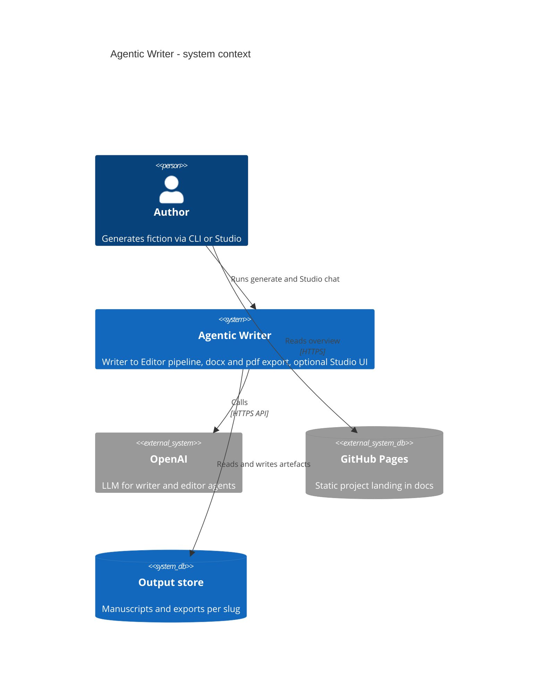
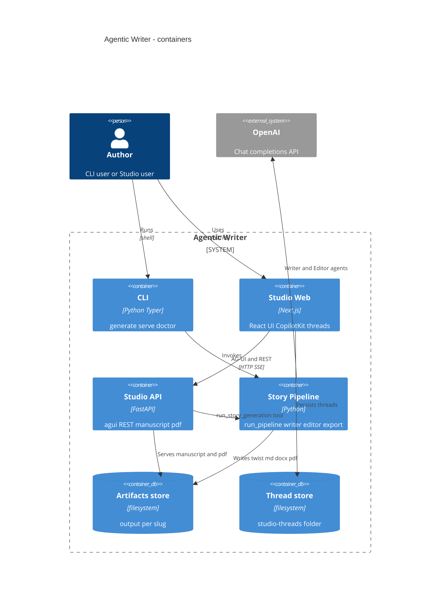
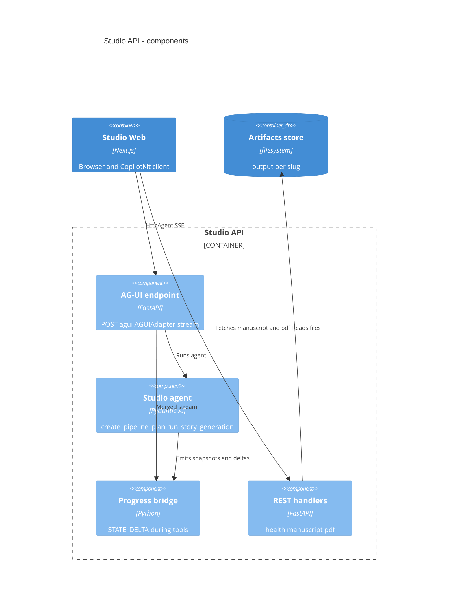
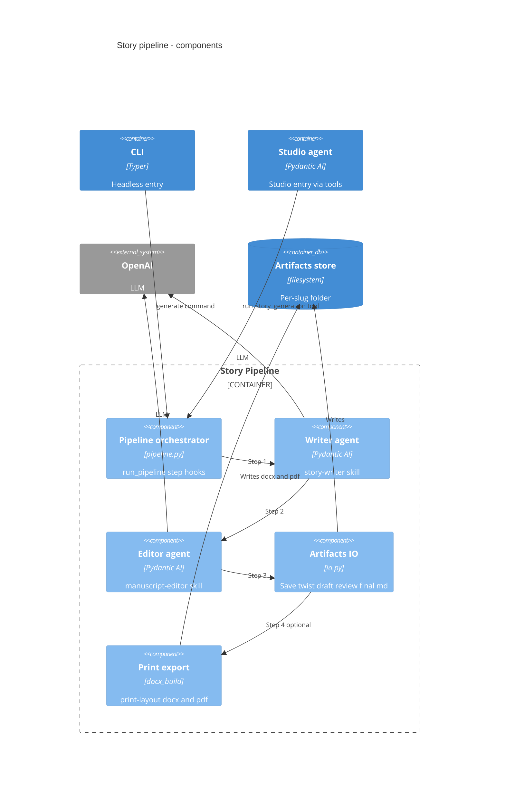
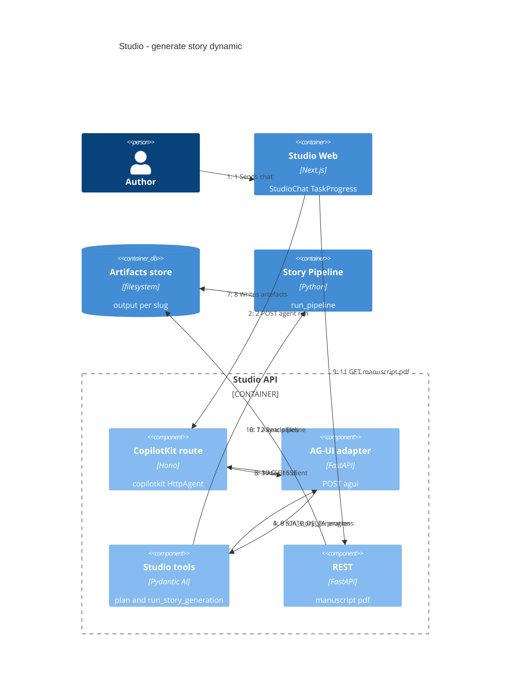
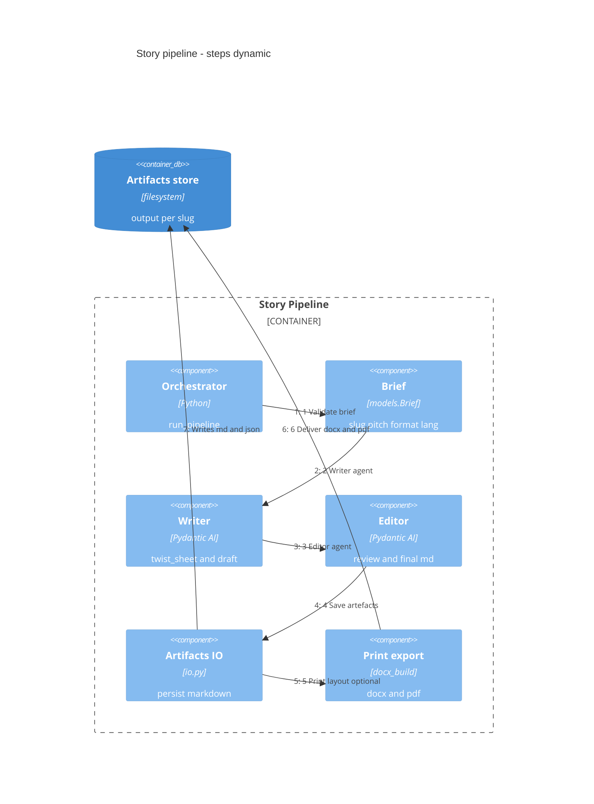
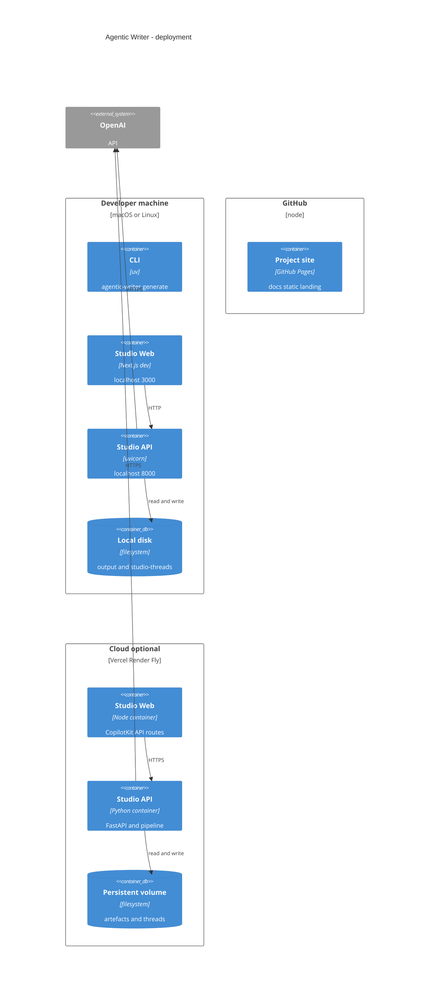

# Agentic Writer

Automated **story pipeline** (Writer → Editor → markdown → **docx/pdf**). **CLI** runs it headlessly; **Studio** adds [CopilotKit](https://www.copilotkit.ai/) v2 + [AG-UI](https://docs.ag-ui.com/) generative UI (pipeline state, manuscript, PDF) over the same `run_pipeline()`.

**Site:** [nmarchand73.github.io/Agentic-writer](https://nmarchand73.github.io/Agentic-writer/) · **Repo diagrams:** [`docs/diagrams/`](docs/diagrams/)

---

## Architecture

One pipeline, two entry points: **CLI** (`generate`) and **Studio** (Next.js + FastAPI `/agui`). C4 views below render on [GitHub](https://github.com/nmarchand73/Agentic-writer); sources live in [`docs/diagrams/`](docs/diagrams/).

### System context



### Containers



<details>
<summary>More diagrams (components, flows, deployment)</summary>

### Studio API components



### Story pipeline components



### Studio generate (runtime)



### Pipeline steps

Labels match `pipeline_steps.py` (CLI, Studio, BDD).



| Step | Output in `output/<slug>/` |
|------|----------------------------|
| Writer | `twist_sheet.json`, `draft_manuscript.md` |
| Editor | `review.md`, `manuscript_final.md` |
| Print | `<slug>.docx`, `<slug>.pdf` (omit with `--md-only`) |

### Deployment



GitHub Pages = static `docs/` only. Live Studio needs **Node** (web) + **Python** (API); `OPENAI_API_KEY` stays on the API host.

</details>

### Key paths

| Path | Role |
|------|------|
| `src/agentic_writer/` | CLI, pipeline, agents, FastAPI studio |
| `web/` | Next.js Studio, CopilotKit runtime |
| `skills/` | story-writer, manuscript-editor, print-layout |
| `specs/bdd/`, `tests/bdd/` | Gherkin + pytest-bdd |
| `NewBooks/output/` | Generated stories (gitignored) |
| `.data/studio-threads/` | Studio chat history (gitignored) |

---

## Why this stack

**CopilotKit + AG-UI** — Standard SSE agent wire; generative UI via `StudioState` (`STATE_SNAPSHOT` / `STATE_DELTA`); Python agent + Next.js UI; persisted threads; progress streaming during long tools.

**BDD** — Executable specs in [`specs/bdd/`](specs/bdd/); CI markers (`bootstrap`, `unit`, `integration`, `ui`) run without OpenAI; one feature file per slice.

---

## Prerequisites

- **uv** + Python ≥ 3.10
- **Node.js** ≥ 18
- **OpenAI API key** (generate / Studio; not for mocked tests)
- **LibreOffice** (`soffice`) — PDF only (or `--md-only`)

---

## Install

```bash
cd Agentic-writer
uv sync --all-extras
npm install && cd web && npm install && cd ..
cp .env.example .env     # set OPENAI_API_KEY
uv run agentic-writer doctor
```

---

## Configuration

| File | Purpose |
|------|---------|
| `.env` | `OPENAI_API_KEY`, `OPENAI_MODEL`, `AGENTIC_WRITER_OUTPUT`, `AGENTIC_WRITER_THREADS_DIR` |
| `config.toml` | Default `format`, `lang`; `output.root` → `NewBooks/output/` |
| `web/.env.local` | `NEXT_PUBLIC_AGENTIC_WRITER_API`, `AGENTIC_WRITER_AGUI_URL` (default `http://127.0.0.1:8000`) |

---

## Run — CLI

```bash
uv run agentic-writer generate <slug> \
  --pitch "Your pitch." \
  --format nouvelle \
  --lang fr
```

| Flag | Purpose |
|------|---------|
| `--brief path.yaml` | YAML brief |
| `--md-only` | Skip docx/pdf |
| `-v` / `-q` | DEBUG / WARNING logs |

**Output:** `NewBooks/output/<slug>/` — markdown artefacts plus optional docx/pdf.

```bash
uv run agentic-writer generate --brief examples/briefs/flash-smoke.yaml --md-only
```

---

## Run — Studio

One script starts the API and the Next.js UI (Ctrl+C stops both):

```bash
./scripts/run.sh
# or: npm run studio
# first time: ./scripts/run.sh --install
```

Manual split (two terminals):

```bash
uv run agentic-writer serve --port 8000
cd web && npm run dev
```

Open [http://localhost:3000](http://localhost:3000). **History** resumes chats from `.data/studio-threads/`.

---

## Tests

```bash
uv run pytest -m "bootstrap or unit or integration or ui"   # CI, no OpenAI
uv run pytest tests/bdd/                                    # all Gherkin
uv run pytest -m e2e                                        # live API
cd web && npm run build                                     # optional
```

Details: [`specs/bdd/README.md`](specs/bdd/README.md).

---

## Troubleshooting

| Issue | Check |
|-------|--------|
| `doctor` fails | `skills/story-writer/SKILL.md`, root `npm install` |
| No docx/pdf | Node + `docx`; or `--md-only` |
| No PDF | LibreOffice / `soffice` |
| Studio errors | `serve` up, `OPENAI_API_KEY`, `web/.env.local` |

Design notes: [`../doc/agentic-writer/plan.md`](../doc/agentic-writer/plan.md).
