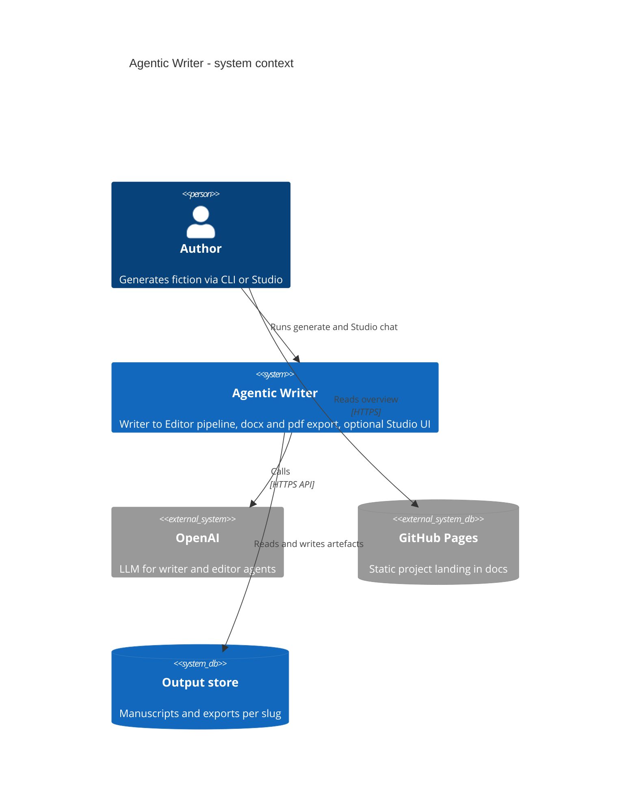
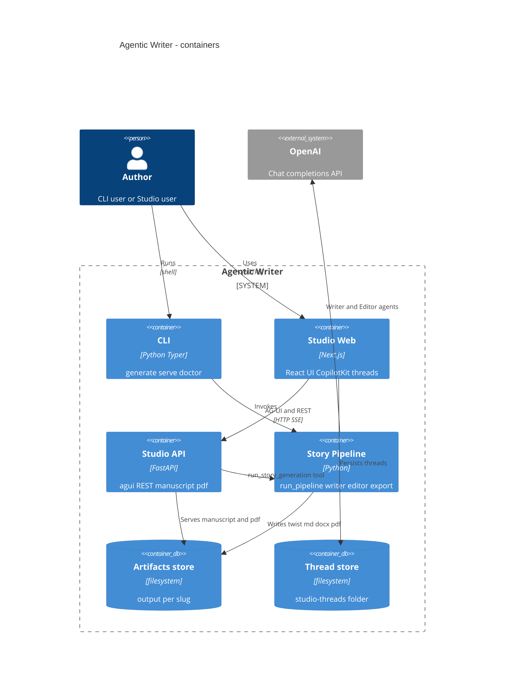
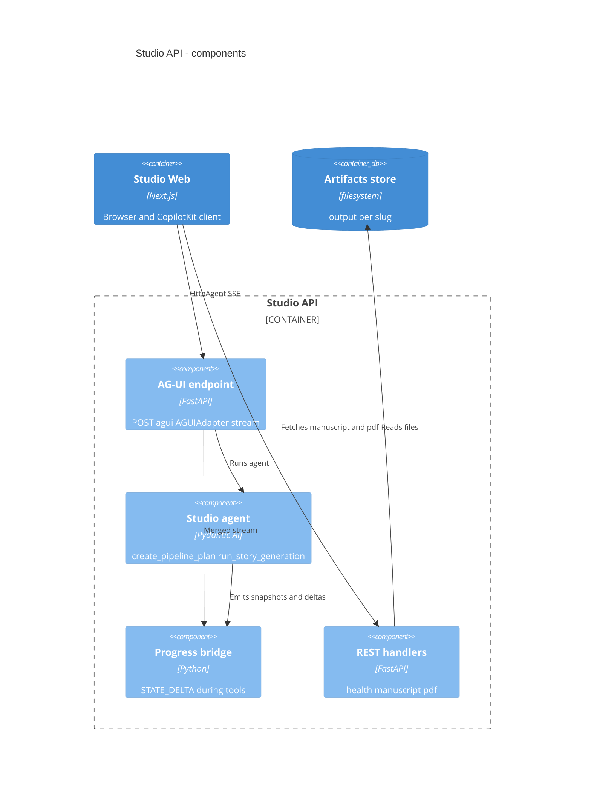
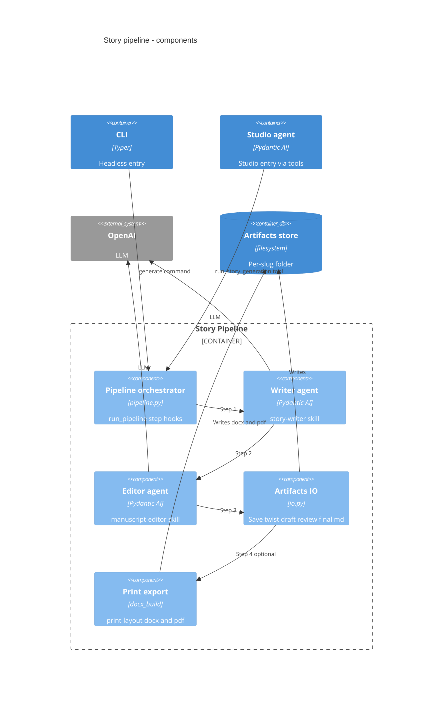
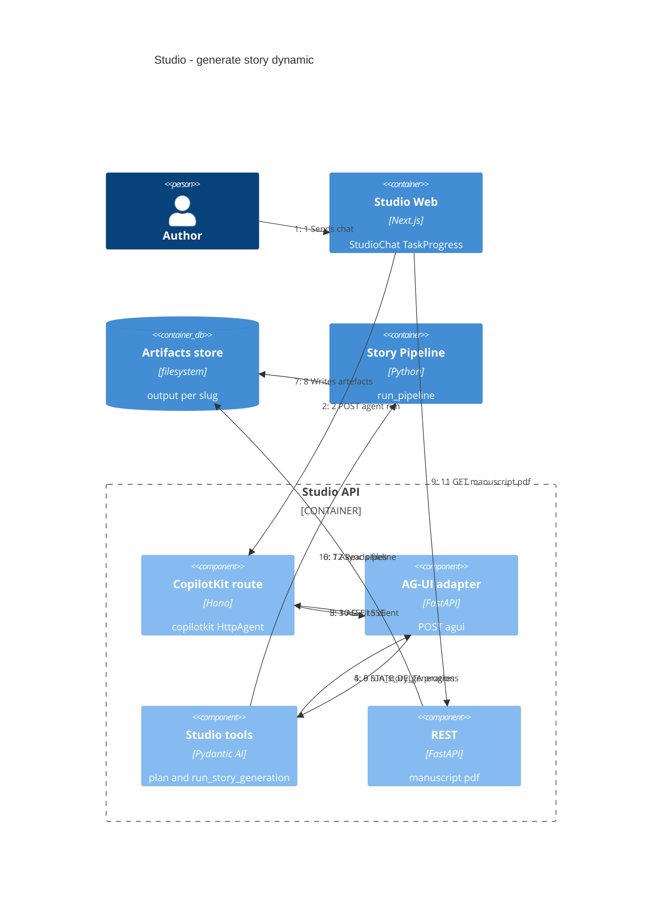
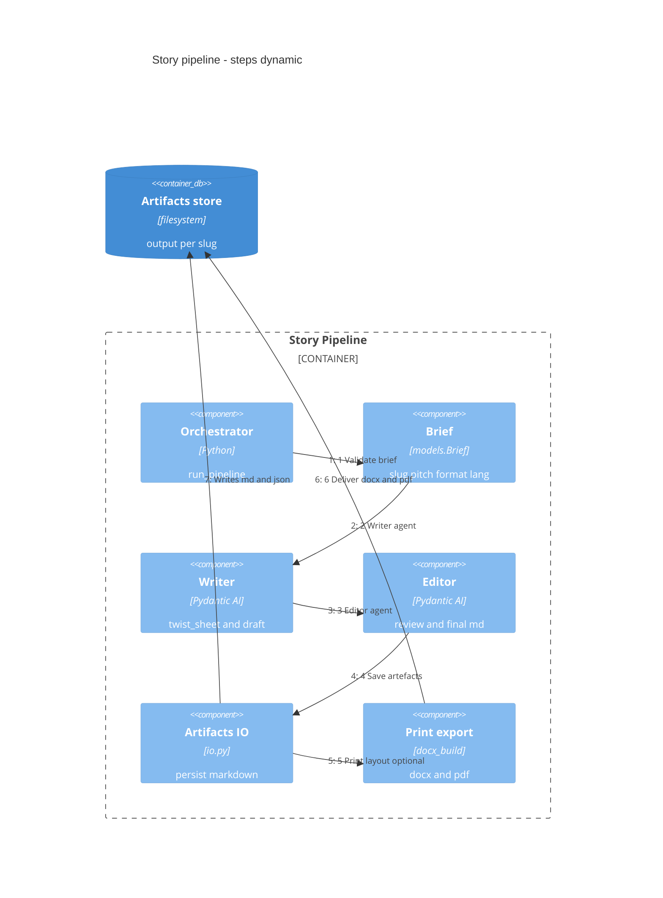
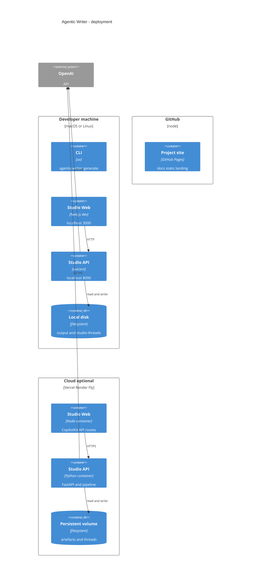

# Agentic Writer

Automated **story pipeline** (Writer → Editor → markdown → **docx/pdf**). The **Studio** uses **[CopilotKit](https://www.copilotkit.ai/) v2** + **[AG-UI](https://docs.ag-ui.com/)**: **Pydantic AI** serves `/agui`, **Next.js** runs the CopilotKit runtime (`HttpAgent`, persisted threads). **Generative UI** syncs pipeline steps, manuscript, and errors via shared agent state (`STATE_SNAPSHOT` / `STATE_DELTA`)—not chat-only. **CLI** runs the same pipeline headlessly.

**Site:** [nmarchand73.github.io/Agentic-writer](https://nmarchand73.github.io/Agentic-writer/) (overview) · full Studio runs locally.

---

## Architecture

Agentic Writer is **one story pipeline** with **two entry points**: the **CLI** (headless) and the **Studio** (browser + generative UI). Both call the same `run_pipeline()` in Python; only the Studio adds AG-UI state, CopilotKit threads, and REST helpers for manuscript/PDF.

Diagrams use the [C4 model](https://c4model.com/) in [Mermaid](https://mermaid.ai/open-source/syntax/c4.html) fenced blocks below. **They render on GitHub** when you view this README on the repo ([creating diagrams](https://docs.github.com/en/get-started/writing-on-github/working-with-advanced-formatting/creating-diagrams)). Editable copies: [`docs/diagrams/`](docs/diagrams/).

### Level 1 — System context (C4Context)



### Level 2 — Containers (C4Container)



### Level 3 — Components (C4Component)

**Studio API** (`src/agentic_writer/api/`)



**Story pipeline** (`src/agentic_writer/`)



### Dynamic — Studio generate (C4Dynamic)

Numbered `Rel` order = runtime sequence.



- **Generative UI:** `StudioState` (slug, steps, errors) via AG-UI `STATE_SNAPSHOT` / `STATE_DELTA`; manuscript body loaded from REST, not stuffed into state.
- **Threads:** `StudioAgentRunner` persists CopilotKit threads under `.data/studio-threads/` (`AGENTIC_WRITER_THREADS_DIR`).
- **Long runs:** `StudioProgressBridge` streams step updates while `run_story_generation` is still running.

### Dynamic — Pipeline steps (C4Dynamic)

Same labels as `pipeline_steps.py` (CLI logs, Studio checklist, BDD).



| Step | Code | Output (under `output/<slug>/`) |
|------|------|----------------------------------|
| Brief | `models.Brief`, `brief_io` | — |
| Writer | `agents/writer` + `skills/story-writer/` | `twist_sheet.json`, `draft_manuscript.md` |
| Editor | `agents/editor` + `skills/manuscript-editor/` | `review.md`, `manuscript_final.md` |
| Artefacts | `io.save_artifacts` | all markdown + JSON |
| Print | `docx_build` + `skills/print-layout/` | `<slug>.docx`, `<slug>.pdf` (skip with `--md-only`) |

### Repository map

| Path | Role |
|------|------|
| `src/agentic_writer/cli.py` | Typer commands (`generate`, `serve`, `doctor`) |
| `src/agentic_writer/pipeline.py` | Orchestrates Writer → Editor → export |
| `src/agentic_writer/agents/` | Pydantic AI writer & editor agents |
| `src/agentic_writer/api/app.py` | FastAPI app, CORS, REST + `/agui` |
| `src/agentic_writer/api/studio.py` | Studio agent + tools (`run_story_generation`) |
| `skills/story-writer/`, `skills/manuscript-editor/`, `skills/print-layout/` | Prompt/skill packs loaded by agents & docx |
| `web/components/` | Studio UI (chat, progress, manuscript, PDF tabs) |
| `web/lib/copilotkit-runtime.ts` | CopilotKit v2 handler → `HttpAgent` → `/agui` |
| `web/lib/studio-agent-runner.ts` | Thread list/messages + disk persistence |
| `specs/bdd/`, `tests/bdd/` | Gherkin scenarios + pytest-bdd |
| `NewBooks/output/` | Generated stories (gitignored) |
| `.data/studio-threads/` | Studio chat history (gitignored) |
| `docs/` | Static GitHub Pages landing |

### Deployment (C4Deployment)

GitHub Pages hosts static content only; the live Studio needs Node + Python hosts (or containers).



| Surface | Host | Notes |
|---------|------|--------|
| Landing | **GitHub Pages** (`docs/`) | Static overview only |
| Studio UI | **Node host** (local `npm run dev`, or Vercel/Netlify) | Needs `/api/copilotkit` API routes |
| Agent API | **Python host** (local `serve`, or container on Render/Fly/etc.) | `OPENAI_API_KEY` stays server-side |
| Full stack on Pages alone | Not supported | Pages cannot run FastAPI or Next.js server routes |

---

## Why this stack

### CopilotKit, AG-UI & generative UI

| Benefit | What you get |
|---------|----------------|
| **Standard agent ↔ UI wire** | AG-UI events (SSE) instead of ad-hoc WebSockets or custom JSON for every screen. |
| **Generative UI, not chat-only** | Pipeline steps, slug, errors, and deliverables live in **shared agent state**—the React tree reacts to `STATE_DELTA` while tools run. |
| **Backend freedom** | Python agent (Pydantic AI + skills) stays in FastAPI; the UI stays in Next.js via `HttpAgent`—clear split, same contract as other AG-UI clients. |
| **Threads & replay** | CopilotKit v2 multi-route API + on-disk persistence: resume conversations and reconnect without re-prompting from scratch. |
| **Progress on long tools** | `StudioProgressBridge` streams step updates during `run_story_generation`, so the UI does not freeze until the tool returns. |
| **Faster product iteration** | CopilotKit chat, suggestions, and runtime plumbing are off-the-shelf; you focus on story tools and `StudioState`. |

### BDD (Gherkin + pytest-bdd)

Specs live in [`specs/bdd/`](specs/bdd/)—executable contracts, not slide-ware.

| Benefit | What you get |
|---------|----------------|
| **Shared language** | Product-style scenarios (`Given` / `When` / `Then`) that devs, QA, and future-you can read without spelunking test code. |
| **CI without OpenAI** | Markers `bootstrap`, `unit`, `integration`, `ui` cover doctor, CLI, pipeline, export, API, and threads with **mocked agents**—cheap, deterministic PR checks. |
| **Slice-aligned coverage** | One feature file per concern (env, CLI, pipeline, export, Studio API, chat persistence, optional `e2e`). |
| **Regression safety** | Changes to brief parsing, artefact paths, print-layout cleanup, or AG-UI state break a named scenario—not a vague “tests failed”. |
| **Living documentation** | Scenarios document *observable* behaviour (files on disk, HTTP status, thread list); see [`specs/bdd/README.md`](specs/bdd/README.md). |

---

## Prerequisites

- **uv** + Python ≥ 3.10  
- **Node.js** ≥ 18 (docx export + Studio)  
- **OpenAI API key** (generate / Studio; not needed for mocked tests)  
- **LibreOffice** (`soffice`) — only for PDF export (skip with `--md-only`)

---

## Install

```bash
cd Agentic-writer
uv sync --all-extras
npm install              # docx export (repo root)
cd web && npm install && cd ..
cp .env.example .env     # set OPENAI_API_KEY
uv run agentic-writer doctor   # must exit 0
```

---

## Configuration

### Root `.env`

| Variable | Required | Default / notes |
|----------|----------|-----------------|
| `OPENAI_API_KEY` | yes (live runs) | — |
| `OPENAI_MODEL` | no | `openai-chat:gpt-4o` |
| `LOG_LEVEL` | no | `INFO` |
| `AGENTIC_WRITER_OUTPUT` | no | see `config.toml` → `NewBooks/output/` |
| `AGENTIC_WRITER_THREADS_DIR` | no | `.data/studio-threads/` (Studio chats) |

### `config.toml`

```toml
[defaults]
format = "nouvelle"   # flash | nouvelle | novella
lang = "fr"

[output]
root = "../output"
```

### Studio — `web/.env.local`

```bash
NEXT_PUBLIC_AGENTIC_WRITER_API=http://127.0.0.1:8000
AGENTIC_WRITER_AGUI_URL=http://127.0.0.1:8000/agui
```

---

## Run — CLI

```bash
uv run agentic-writer generate <slug> \
  --pitch "Your pitch." \
  --format nouvelle \
  --lang fr
```

| Flag | Purpose |
|------|---------|
| `--brief path.yaml` | YAML brief instead of inline slug/pitch |
| `--md-only` | Stop after markdown (no docx/pdf) |
| `-v` / `-q` | DEBUG / WARNING+ logs |

**Output:** `NewBooks/output/<slug>/` — `twist_sheet.json`, `draft_manuscript.md`, `review.md`, `manuscript_final.md`, optional `<slug>.docx` & `.pdf`.

```bash
uv run agentic-writer generate --brief examples/briefs/flash-smoke.yaml --md-only
```

---

## Run — Studio

**Terminal 1 — API**

```bash
uv run agentic-writer serve --port 8000
```

**Terminal 2 — UI**

```bash
cd web && npm run dev
```

Open [http://localhost:3000](http://localhost:3000). Use **History** in the header to resume past chats (stored under `.data/studio-threads/`).

---

## Run — tests

From `Agentic-writer/`:

```bash
# CI suite (no OpenAI)
uv run pytest -m "bootstrap or unit or integration or ui"

# All Gherkin BDD specs
uv run pytest tests/bdd/

# Studio thread persistence (needs npx)
uv run pytest tests/bdd/test_studio_threads.py -m ui

# Live API (needs OPENAI_API_KEY)
uv run pytest -m e2e
```

```bash
cd web && npm run build   # optional frontend check
```

BDD details: [`specs/bdd/README.md`](specs/bdd/README.md).

---

## Layout

See [Architecture](#architecture) for the full component map. Top level:

```text
Agentic-writer/     CLI, pipeline, skills, tests
web/                Studio (Next.js)
NewBooks/output/    generated stories (gitignored)
.data/studio-threads/   Studio chat history (gitignored)
```

---

## Troubleshooting

| Issue | Check |
|-------|--------|
| `doctor` fails | `skills/story-writer/SKILL.md`, `npm install` at root |
| No docx/pdf | Node + `docx` package; or use `--md-only` |
| No PDF | LibreOffice / `soffice` |
| Studio empty / errors | `serve` running, `OPENAI_API_KEY`, `web/.env.local` URLs |

Further design notes: [`../doc/agentic-writer/plan.md`](../doc/agentic-writer/plan.md).
